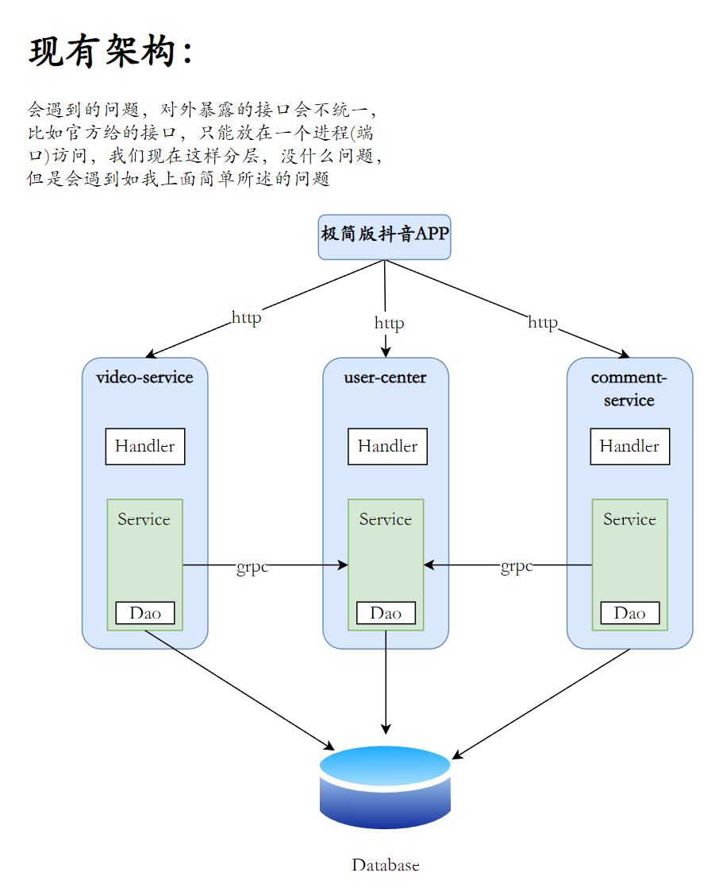
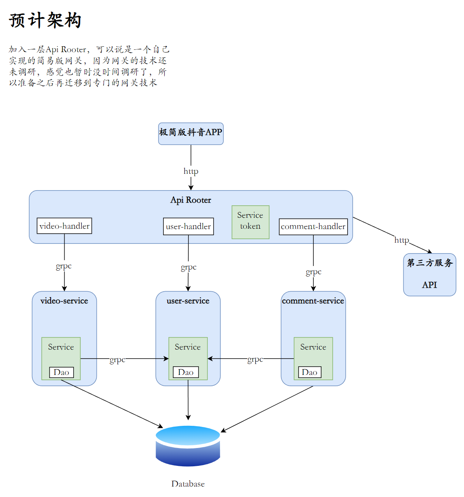

# DouSheng 第五届青训营项目——抖声

## 项目结构





公共模块 —— dou_kit
用户中心 —— user_center
视频服务 —— video_service

## 项目技术方案调研


## 如何启动项目？

1. 利用工作区模式简化本地开发

具体为什么要有工作区模式、有了他有什么好处，之后在写~

先来讲如何使用他

* 拉取项目
```shell
git clone git@github.com:Go-To-Byte/DouSheng.git

cd DouSheng
```

* 初始化`go.work`文件
```shell
go work init dou_kit/ user_center/ video_service/
```
然后你的work文件是这样的：

```text
go 1.19

use (
	user_center
	dou_kit
	video_service
)
```

然后本身是三个独立的服务，虽然放在一个仓库内部的。
就可以直接当作是本地的一个项目了（文件路由引用）
注：所说的是**当作**，此文件不要推送至Git仓库

[推荐文章](https://cloud.tencent.com/developer/article/2200542?areaSource=&traceId=)


2. 添加服务的配置文件

* 添加视频服务配置文件(根据模板填写你自己的配置)
```shell
cd video_service/etc/

cp config.toml.template config.toml
```

* 添加用户中心配置文件(根据模板填写你自己的配置)
```shell
cd user_center/etc/

cp config.toml.template config.toml
```

* 启动前置条件：

1. 安装mysql
2. 安装mongodb
3. 安装consul

自行google安装教程。我之后再写

3. 利用Makefile工程化管理项目

使用前置：安装make指令[推荐第二种](https://tehub.com/a/aCYp1uw0tG)

若安装好后，可以利用Makefile文件，启动项目：
```shell
make run
```
