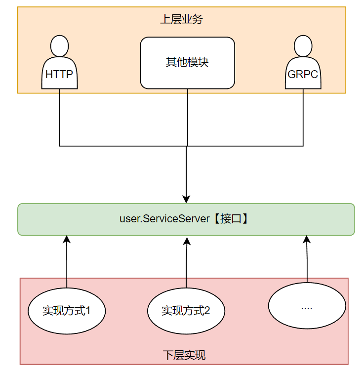
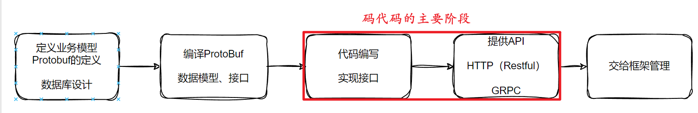

# User 服务模块

## 一、提供的接口
### 1、注册 Register
* [官方接口描述](https://bytedance.feishu.cn/docs/doccnKrCsU5Iac6eftnFBdsXTof#1bQwYM)

### 2、登录 Login
* [官方接口描述](https://bytedance.feishu.cn/docs/doccnKrCsU5Iac6eftnFBdsXTof#9UOUMJ)

### 3、用户信息 UserInfo
* [官方接口描述](https://bytedance.feishu.cn/docs/doccnKrCsU5Iac6eftnFBdsXTof#mWFx8s)


## 二、文件目录结构

以此目录文件为例：之后的每一个模块，基本都是这个结构

```
user                    # 用户模块
├── app.go              # 此模块的名称、此模块model的方法[包括构造方法]
├── http                # 对外暴露的HTTP服务
│   ├── http.go         # UserHandler，需要放入IOC容器中
│   └── user.go         # UserHandler接口所需要的方法
├── impl                # UserServiceImpl 用户模块 业务层 接口实现
│   ├── dao.go          # 可以当作是持久层，这里并没有分那么干净（因为没必要）
│   ├── impl.go         # 定义UserServiceImpl，注意需要加入 GRPC 所需的对象（否则不能作为GRPC接口）
│   ├── user.go         # 实现UserService接口定义的方法（注：接口是在GRPC接口之上继续拓展的）
│   └── user_test.go    # 此模块测试用例【一般用于验证数据库操作是否正确，这里也可以直接从IOC里面取出依赖】
├── pb                  
│   └── user.proto      # protobuf文件，此文件需要定义好接口方法、请求参数结构体、响应参数结构体
├── README.md           # 此模块描述文件
├── user.pb.go          # 利用 protc 生成，里面主要有生成的结构体
└── user_grpc.pb.go     # 利用 protc 生成，里面主要有生成的接口方法
```

### 核心编写模块 `impl`

核心就是面向接口编程的思想。此模块实现`（impl）`完接口（业务逻辑）后，上层业务就基于 user.ServiceServer 进行编程。

将其简单抽象一下就是这样的：



user.ServiceServer 定义并把接口实现，可以有很多使用的方式：

* 其他业务员模块，基于它封装更高一层的业务逻辑，比如发布服务
* user.ServiceServer 对外暴露：HTTP协议（暴露给用户）
* user.ServiceServer 对外暴露：GRPC（暴露给内部服务）

相当于按照下面的方式开发：



我们只需要关注业务实现即可
+ 接口与模型定义利用protobuf生成
+ 实例依赖全交由IoC管理
+ 项目工程化交由Makefile管理
+ 项目配置交由conf管理
+ ....
